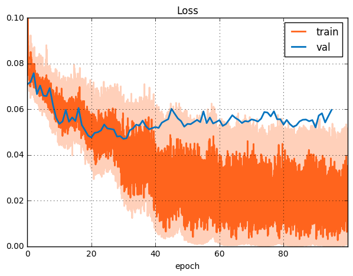

## Проект по DL и LSML 
*Freesound Audio Tagging 2019*

Для начала воспроизведем безлайн 

######  epochs=10, bs=32, lr=3e-4

 

Очевидно, что модель недообучилась. 

Следущем эксперементе увеличили число эпох, зделали cycle lr и применили алгоритм mixup 

######  epochs=96, bs=64, lr=cycle

 

