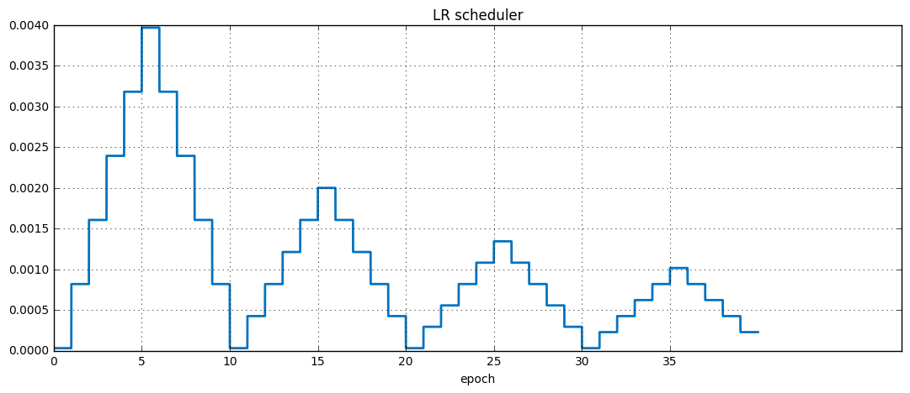

## Проект по DL и LSML 
*Freesound Audio Tagging 2019*

- Для начала воспроизведем безлайн 

######  epochs=10, bs=32, lr=3e-4

 

Очевидно, что модель недообучилась. 

При увеличении эпох до 40 loss улетает

Посмотрим на распределение lelrap по классам:

Далее будем сохранять лучшую модель.
- В следущем эксперементе увеличили число эпох, сделали cycle lr и применили алгоритм mixup 

######  epochs=40, bs=32, lr=cycle

 

На валидации качество подросло. Это видно на картинке ниже:

Также подросло значение per_class_lwlrap для многих классов по сравнению с бейзлайном. 

Низкое значение у классов {11: Buzz,
29: Electric_guitar, 35: Frying_(food), 56: Run, 63: Slam, 77: Writing, 79: Zipper_(clothing)}

