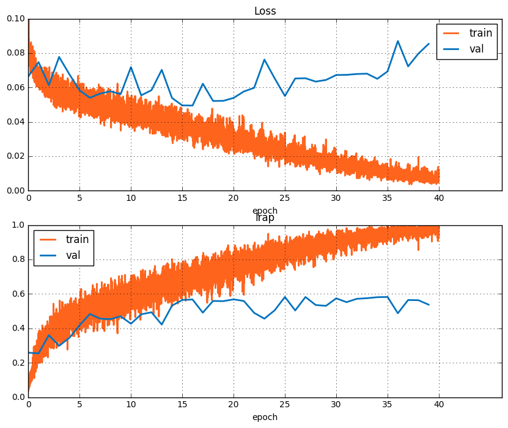

## Проект по DL и LSML 
*Freesound Audio Tagging 2019*

## Вокруг безлайна

#### Для начала воспроизведем безлайн 

######  epochs=10, bs=32, lr=3e-4

 

Очевидно, что модель недообучилась. 

При увеличении эпох до 40 loss улетает

Посмотрим на распределение lelrap по классам:

Далее будем сохранять лучшую модель.
#### В следущем эксперементе увеличили число эпох, сделали cycle lr и применили алгоритм mixup 

######  epochs=40, bs=32, lr=cycle

 

На валидации качество подросло. Это видно на картинке ниже:

#### Применение SWA, начиная с 30 эпохи, не улучшает рузультат

####  Посмотрим на метрику на разных классах.

 - Подросло значение per_class_lwlrap для многих классов по сравнению с бейзлайном. 

Низкое значение у классов:

11: Buzz 

29: Electric_guitar 

35: Frying_(food) 

56: Run, 63: Slam 

77: Writing 

79: Zipper_(clothing)

 - Разобъем per_class_lwlrap отдельно по типу данных: 

Видно, что curated моделируется лучше, чем noisy.

Например, для класса Zipper_(clothing) в noisy части много файлов, не относящихся к этому звуку:

Zipper_(clothing)

028cd525.wav, e05b61e6.wav, d3e4a81e.wav - разговор

2e043da5.wav,397074a3.wav - машина

087a2f52.wav - стук

Поэтому, такое плохое качество на noisy данных в этом классе. 

Намного лучше результаты на noisy данным по тегам `Run` и  `Walk_and_footsteps`. Заметим, что эти теги встречаются вместе только в noisy данных. При прослушивании они сопроваждаются посторонними звуками (например, поддержка болельщиков или разговор людей), которые могут вносить основной вклад в предсказания. 

## Архитектура из статьи

В качестве архитектуры была взята GCNN из статьи  *https://arxiv.org/pdf/1710.00343.pdf*. Было изменено количество каналов со 128 до 64 (иначе не хватает памяти) в сверточном слое, в качестве активации у  рекурентного слоя использовалась только сигмоида. 

Модель обучалась, но постепенно градиенты уходили в 0, и модель переставала обучаться.  Следующая картинка - норма градиентов на одном из слоев: 

